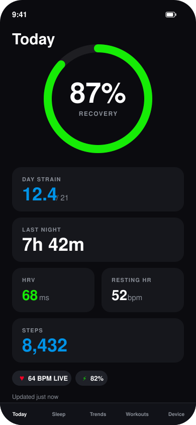
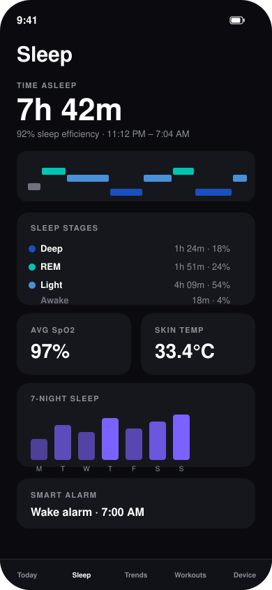
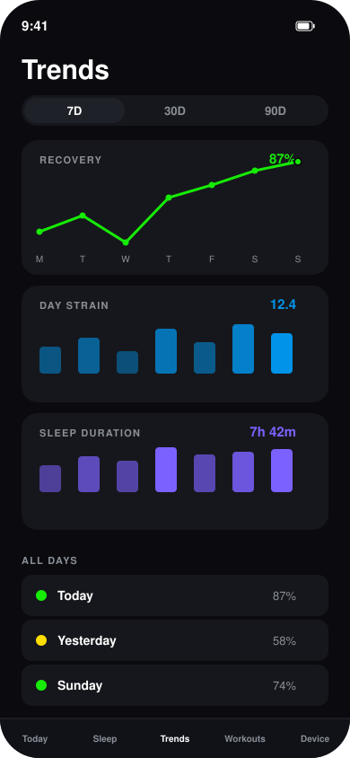

# OpenWhoop

See [docs/ARCHITECTURE.md](docs/ARCHITECTURE.md) for an architecture diagram.

An open-source iOS companion app for the WHOOP 4.0 strap. Connects over Bluetooth to read heart rate, HRV, sleep, workouts, and strain locally on-device — no WHOOP account or cloud subscription required.

## Screenshots

*Mockups with simulated data — illustrative only, not live app captures.*

| Today | Sleep | Trends |
|:---:|:---:|:---:|
|  |  |  |

## Requirements

- Xcode 16+, iOS 16+
- A WHOOP 4.0 strap
- [XcodeGen](https://github.com/yonaskolb/XcodeGen) to generate the Xcode project from `project.yml`

## Getting started

```bash
xcodegen generate
open OpenWhoop.xcodeproj
```

Fill in `OpenWhoop/Config/Secrets.xcconfig` with your `WHOOP_BASE_URL`, `WHOOP_API_KEY`, and `WHOOP_DEVICE_ID` before building.

## Project structure

- `OpenWhoop/BLE` — Bluetooth connection and protocol handling for the WHOOP strap
- `OpenWhoop/Metrics` — recovery, strain, sleep, and HRV data pipeline
- `OpenWhoop/Analysis` — on-device metrics computation
- `OpenWhoop/Tabs` — the five main app screens (Today, Sleep, Trends, Workouts, Device)
- `OpenWhoop/Design` — shared design tokens (colors, spacing, typography)
- `OpenWhoopTests` — unit tests
- `maestro/` — end-to-end UI test flows
