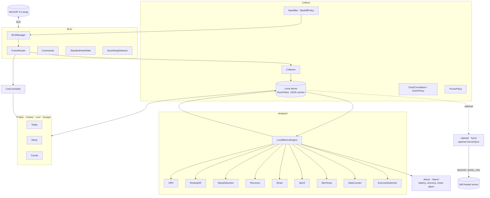

# Architecture

An iOS app that talks to a WHOOP 4.0 strap over Bluetooth and computes health metrics on-device.

```mermaid
flowchart TD
    Strap[(WHOOP 4.0 strap)] <-->|BLE| BLE

    subgraph BLE["BLE/"]
        Mgr[BLEManager] --> FR[FrameRouter]
        Cmd[Commands]
        HR[StandardHeartRate]
        Stuck[StuckStrapDetector]
    end

    subgraph Collect["Collect/"]
        Coll[Collector] --> Store[(Local stores<br/>StorePaths, JSON caches)]
        Back[Backfiller · BackfillPolicy]
        Clock[ClockCorrelation / ClockPolicy]
        Prune[PrunePolicy]
    end

    subgraph Analysis["Analysis/"]
        Eng[LocalMetricsEngine]
        Eng --> HRV & RHR[RestingHR] & Sleep[SleepDetection] & Rec[Recovery] & Str[Strain] & SpO2 & Skin[SkinTemp] & Steps[StepCounter] & Ex[ExerciseDetection]
    end

    subgraph UI["Tabs/ · Charts/ · Live/ · Design/"]
        Today & SleepTab[Sleep] & Trends
    end

    Alerts["Alerts/ · Alarm/<br/>battery, recovery, smart alarm"]
    Up["Upload/ · Sync/<br/>optional ServerSync"]

    FR --> Coll
    Back --> Mgr
    Store --> Eng --> Store
    Store --> UI
    FR --> Live[Live/LiveState] --> UI
    Eng --> Alerts
    Store -.optional.-> Up -->|WHOOP_BASE_URL| Server[(Self-hosted server)]
```

Project generated with XcodeGen; secrets via `Secrets.xcconfig`.
